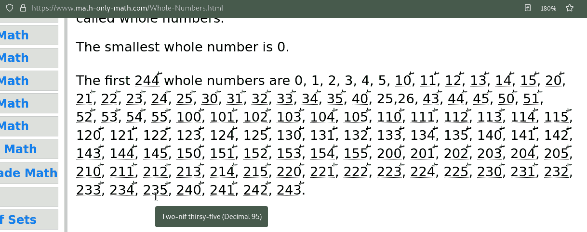

# seximal-extension
Browser extension to convert numbers to seximal (base 6). So "24.5" becomes "40.3" for example, because 4 * 6 + 0 * 1 + 3 * 1/6 == 24.5.

---

**NOTE**

Numbers are really integral pieces of communication, so having software parse
and replace most of the numbers you see can be dangerous. I would not advise
using this plugin while doing anything important. As per the license,
you shouldn't sue me for anything.

---

Why seximal? Check out <https://www.seximal.net/>. All the naming conventions used are copied from [the words page](https://www.seximal.net/words).

## Features

- Currently, it finds (most) decimal numbers in a page, and replaces them with their seximal form.
- Integers 5 down to -5 are unchanged.
- Where a number is replaced, it adds a small character as a marker to indicate the replacement.
- Surrounds changed numbers in `<abbr>` tags, so hovering will show the spelled-out seximal name and the decimal numerals that were replaced.

The goal is that it's always clear exactly where replacements have happened:

## Usage

Right now its just a proof-of-concept firefox extension. The JS is one basic file so I think porting to chrome will be trivial.

To temporarily load the Add-on in Firefox:
1. Download this repository
1. In Firefox, Go to `about:debugging`
1. Click "This Firefox"
1. Click "Load Temporary Add-on..."
1. Navigate to the downloaded repository.
1. Double click on `manifest.json`

## TODO:
- Add chrome.
- Make more efficient.
- Fix rounding errors.
- It would be fun to also convert number names: "one hundred" ->  "two nif foursy four". Detecting and converting these could add lots of weight though.
- Distribute?

---
### Reflections on the experience
1. Clock time: `12:59` becomes `20:135`. Sometimes having three digits is annoying.
1. MM/DD dates are fine: `12/31` becomes `20/51`
1. The year is cumbersome: `2022` -> `13210` (the easily pronounceable "One unexian thirsy-two-nif six". Just like we do in decimal, a seximal society would make special cases for how to say years)
1. More generally, `10000` or "One unexian" (decimal 1296) comes too soon with too many syllables. By comparison, "One thousand" is only three syllables for a similar quantity.
1.  Using this reinforces why it would be terrible to seriously try to transition to seximal, either personally or as a society. It's like trying to learn a new language that uses the same words and grammar, but all the frogs are gilded downwards.

It will always be fundamentally impractical, but as a fun toy, it could perhaps be more comfortable to use. Perhaps if slightly different number symbols were used, my brain wouldn't be so discombobulated.

It would be interesting if jan Misali would revise anything on seximal.net based on these practical considerations?

(Regarding the code: I couldn't find a good way to do the html insertion in one go, so right now there's an awkward substitution that puts the `<` and `>` characters in. I'm open to suggestions on how to make this better/faster.)